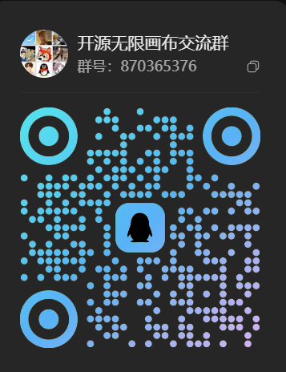

# 聚梦画布（开源版）

AI 视频 / 图片创作画布：节点工作流、素材管理、生成任务队列、算力账本。  
技术栈：**Next.js** 前端 + **FastAPI** API / Worker + **MySQL 8** + **Redis**。

本仓库是清洗后的开源副本：**不含**生产密钥、服务器地址、模型目录和公司备案 / 统计账号。克隆后需自行配置数据库、供应商密钥，并在管理后台录入模型。

许可证：[MIT](./LICENSE)

## 社区与 API

- 开源无限画布交流 QQ 群：`870365376`

  

- 聚梦 API 国内站：<https://www.jumengai.com/>
- 聚梦 API 海外站：<https://www.jumai.ai/>

## 功能

- 画布工作流（图 / 视频 / 文本 / 音频节点）
- 用户注册登录（开发环境可走本地短信调试）
- 管理后台：模型、定价、页脚、用户与算力
- Docker Compose 一键拉起 MySQL / Redis / API / Worker
- 本地模型：管理后台可从本机 ComfyUI 一键同步；用户也可在个人中心挂自己的图 / 视频模型（不绑定固定路径或某一型号）

## 快速开始

环境要求：Docker Desktop、Node.js 20+、npm。

```bash
git clone https://github.com/lkw2731938298/jumeng-canvas-saas-sanitized.git
cd jumeng-canvas-saas-sanitized

# 本地密钥文件（不要提交）
cp config/llm-keys.example.env config/llm-keys.env
cp packages/api/.env.example packages/api/.env
cp .env.example .env

# 后端
docker compose up -d --build

# 前端
npm install
npm run dev
```

开发管理员（需在 `.env` 中设置 `DEV_ADMIN_PASSWORD`）：

- 手机号：`13800000000`
- 密码：你在 `.env` 里填写的 `DEV_ADMIN_PASSWORD`

默认开启本地存储（`CANVAS_STORAGE_LOCAL_ONLY=true`）和短信调试。上线前请关闭调试开关，配置真实 JWT、OSS、短信与支付，并在后台填写自己的 ICP 备案号。

## 配置说明

| 文件 | 用途 |
|------|------|
| `.env.example` | Docker Compose / JWT / 本地存储 |
| `packages/api/.env.example` | API 进程环境变量 |
| `config/llm-keys.example.env` | 大模型供应商密钥（空模板） |
| `scripts/deploy/env.sh.example` | 自建部署变量模板 |

**不要**把真实口令、API Key、ICP 备案号写进仓库。

## 本地模型

自建部署可把**你自己的** ComfyUI / Ollama / vLLM 接到画布，步骤见 [docs/local-models.md](./docs/local-models.md)。不绑定固定磁盘路径或某一型号。

## 贡献与安全

- 参与开发：[CONTRIBUTING.md](./CONTRIBUTING.md)
- 漏洞报告：[SECURITY.md](./SECURITY.md)
- 行为准则：[CODE_OF_CONDUCT.md](./CODE_OF_CONDUCT.md)

## 声明

本仓库用于二次开发与自建部署，不能直接连接任何现网生产环境。
